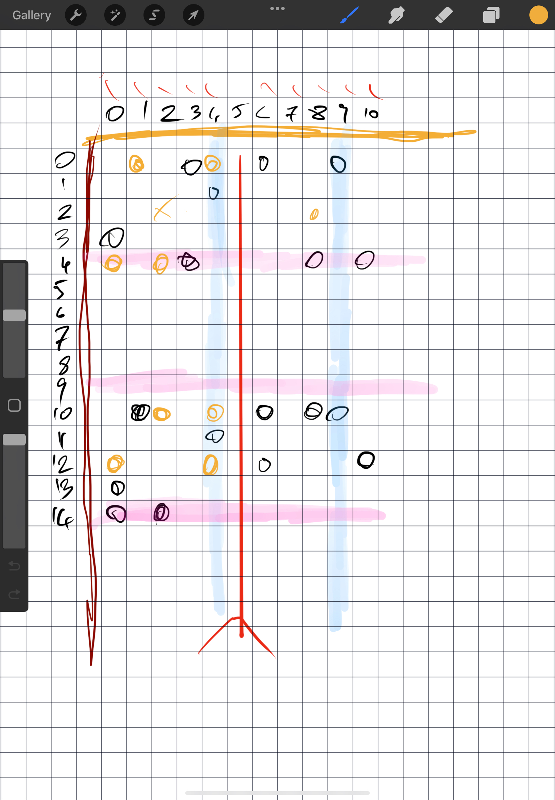

# Day 13

## Task 1
First we have a bunch of coordinates, which I turned into a map of points. Coordinates were stored in 23 bits – 11 upper register for the x coordinate, and 11 lower register for the y coordinate.

Then I wrote a function that takes in a paper map and a value to fold by, and for points that lie on the right, or below of the line, it calculates the mirror place, and moves it into a new map.



The formula for the new coordinate is

```go
newCoord := foldBy << 1 - oldCoord
```
where `foldBy` is the line (vertical 5 in the image above), and oldCoord is the part of the coordinate that we need to move.

Double the line, and subtract the old coordinate, and done!

## Task 2

For task two all I had to do is repeat the folding until I ran out of fold instructions.

Visualizing was a snag though. First I had to walk through the resulting folded paper to figure out the max width and heigh, and then I did a CRT like stuff where I scan each row, and each point in each row, and light it up if there's anything in the paper map.
